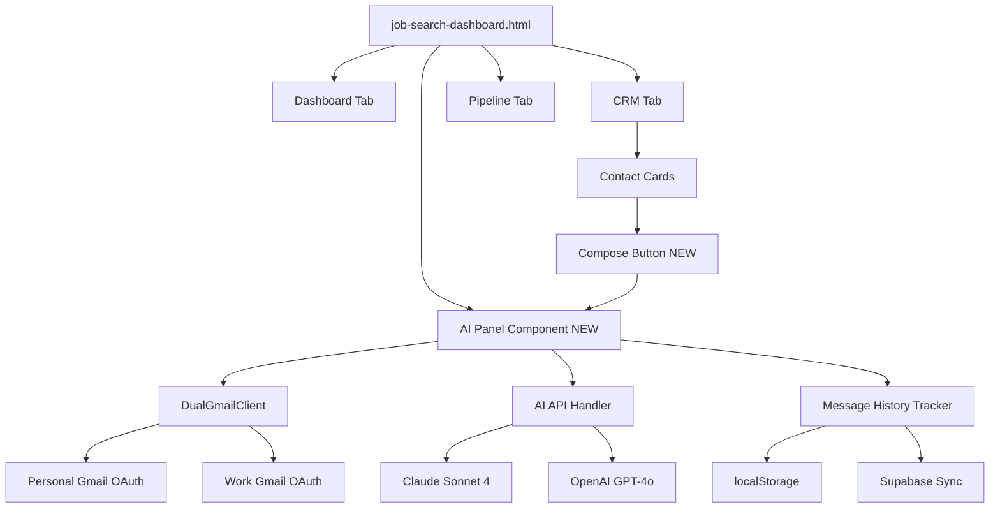
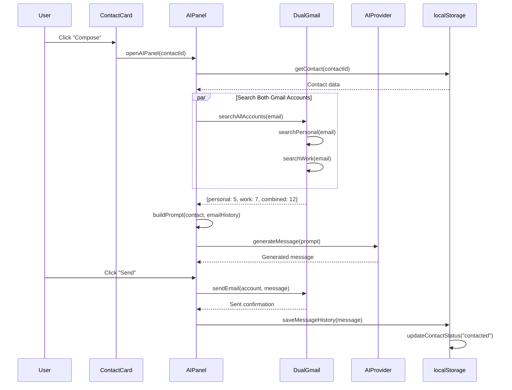

# AI-Powered Job Search CRM - Product Specification

**Version:** 1.0.0
**Last Updated:** 2024-12-12
**Owner:** Luis Calderon

---

## 1. Overview

### 1.1 Product Vision

Transform the job search process from a fragmented experience across multiple tools into a unified, AI-powered command center that intelligently connects CRM, email context, and message generation to maximize outreach effectiveness.

### 1.2 Goals

**Primary Goals:**
- **Eliminate context switching:** Compose AI-generated messages without leaving the CRM
- **Maximize personalization:** Automatically pull email history from both personal and work Gmail accounts
- **Track performance:** Log all sent messages and measure response rates
- **Accelerate workflows:** Reduce time-to-compose from 5-10 minutes to < 2 seconds

**Success Metrics:**
- Time to compose message: < 2 seconds from contact card
- Message quality score: AI references specific email history in 90%+ of messages
- Response rate: Track and improve with A/B testing
- User satisfaction: Zero page navigations required for compose workflow

### 1.3 Target User

Luis Calderon - VP/Director/Principal PM candidate targeting AI/PLG companies

**User Context:**
- Ross MBA '11, led $900M TurboTax P&L at Intuit
- AI/ML product expertise pre-ChatGPT
- Active job search with 50+ contacts across personal and work networks
- Needs to maintain warm relationships while exploring opportunities

---

## 2. User Workflows

### 2.1 Compose Message from CRM (Primary Workflow)

**Goal:** Generate and send a personalized outreach message in < 2 seconds

**Steps:**
1. User browses contacts in CRM tab
2. Clicks **"📧 Compose"** button on contact card (e.g., Sarah Chen @ Stripe)
3. AI panel slides in from right (300ms animation)
4. System automatically:
   - Loads contact details (name, title, company, notes)
   - Searches both Gmail accounts in parallel (personal + work)
   - Displays unified email history: "12 emails (5 personal, 7 work)"
5. User reviews pre-populated settings:
   - Message Type: "Email Follow-up" (auto-selected based on contact status)
   - Tone: "Professional Casual" (default)
   - Additional Context: (optional field)
6. User clicks **"Generate"**
7. AI generates message in < 5 seconds using:
   - Contact context
   - Email history summary
   - User's background (Ross MBA, Intuit P&L, AI expertise)
   - Connection type (Ross alumni in this case)
8. Generated message appears with actions:
   ```
   Subject: Re: Product opportunity at Stripe

   Hi Sarah,

   Go Blue! Great seeing your updates on Stripe's AI payment features...
   [AI-generated message with specific references to past emails]

   [Copy] [Send via Gmail] [Save Draft]
   ```
9. User reviews, optionally edits
10. Clicks **"Send via Gmail"** → selects account (Personal)
11. Email sent, message logged to contact record with:
    - Timestamp
    - Message type
    - Sent via: Personal
    - AI-generated: Yes
12. Contact status automatically updated to "Contacted"
13. Panel closes (or stays open for next contact)

**Time:** < 2 seconds from click to send (excluding user review time)

**Screenshot:** `docs/screenshots/compose-workflow.png`

---

### 2.2 Configure Dual Gmail Accounts

**Goal:** Connect both personal and work Gmail for comprehensive email history

**Steps:**
1. User navigates to Settings (gear icon)
2. Scrolls to **"Gmail Accounts"** section
3. Sees two account slots:
   ```
   📧 Personal Gmail    [Not Connected]
   💼 Work Gmail        [Not Connected]
   ```
4. For Personal Gmail:
   - Clicks **"Configure"**
   - Modal opens with instructions:
     - "Get OAuth Client ID from Google Cloud Console"
     - Link to setup guide: [docs/gmail-oauth-setup.md]
   - Pastes Client ID: `123456789.apps.googleusercontent.com`
   - Clicks **"Connect Personal Gmail"**
   - OAuth popup opens → user grants permissions
   - Status updates: ✅ Connected (lcalderon@gmail.com)
5. Repeats for Work Gmail with different Client ID
6. Both accounts now show connected:
   ```
   📧 Personal Gmail    ✅ Connected (lcalderon@gmail.com)
   💼 Work Gmail        ✅ Connected (luis@company.com)
   ```
7. Clicks **"Save Settings"**

**Note:** Tokens expire after 1 hour. System auto-detects expiry and prompts re-auth.

**Screenshot:** `docs/screenshots/gmail-config.png`

---

### 2.3 View Message History for Contact

**Goal:** See all past AI-generated and manual messages sent to a contact

**Steps:**
1. User opens contact modal (click contact name)
2. Navigates to **"Messages"** tab
3. Sees timeline of all sent messages:
   ```
   📧 Dec 12, 2024 - Email Follow-up (via Personal)
   Subject: Re: Product opportunity
   Body: Hi Sarah, Go Blue! Great seeing...
   Response: Not yet

   📧 Nov 1, 2024 - Initial Outreach (via Work)
   Subject: Ross alumni coffee chat?
   Body: Hi Sarah, I was at the Ross event...
   Response: ✅ Responded (Nov 3)
   ```
4. Each message shows:
   - Date/time sent
   - Message type
   - Account used (Personal/Work)
   - AI-generated badge
   - Response status (tracked manually or via Gmail API)
5. Can click message to expand full content
6. Can mark as "Responded" if reply received

**Screenshot:** `docs/screenshots/message-history.png`

---

### 2.4 Generate 3 Message Variations (A/B Testing)

**Goal:** Test different approaches to see which performs best

**Steps:**
1. User clicks **"Compose"** on contact
2. AI panel opens
3. Instead of **"Generate"**, user clicks **"3 Variations"**
4. System generates 3 different messages simultaneously:

   **Variation A: Alumni Angle**
   > Go Blue! I led Intuit's $900M Self-Employed business and saw you're scaling AI payments at Stripe...

   **Variation B: Company Challenge**
   > Saw Stripe recently launched fraud detection AI. I shipped 4 AI products at Intuit pre-ChatGPT...

   **Variation C: Mutual Connection**
   > [Mutual contact] mentioned you're hiring PMs for AI initiatives. My background...

5. User compares side-by-side
6. Selects best one → **"Use Variation B"**
7. Proceeds to send as normal

**Future:** Track which variation types get highest response rates

**Screenshot:** `docs/screenshots/ab-testing.png`

---

## 3. Technical Architecture

### 3.1 System Overview

**Architecture Pattern:** Static HTML/JS with browser-based OAuth and localStorage persistence

```
┌─────────────────────────────────────────────────────────┐
│                   Browser (Client-Side)                  │
├─────────────────────────────────────────────────────────┤
│                                                          │
│  ┌──────────────┐      ┌──────────────┐               │
│  │  Dashboard   │◄────►│  AI Panel    │               │
│  │  (CRM Tabs)  │      │  (Side Panel)│               │
│  └──────┬───────┘      └──────┬───────┘               │
│         │                     │                         │
│         ▼                     ▼                         │
│  ┌──────────────────────────────────┐                  │
│  │      localStorage (Primary)      │                  │
│  │  - Contacts                      │                  │
│  │  - Message History               │                  │
│  │  - Gmail Tokens (personal/work)  │                  │
│  │  - AI API Keys                   │                  │
│  └──────────────────────────────────┘                  │
│         │                     │                         │
└─────────┼─────────────────────┼─────────────────────────┘
          │                     │
          ▼                     ▼
   ┌─────────────┐      ┌─────────────────┐
   │  Supabase   │      │  Gmail API      │
   │  (Cloud)    │      │  (Personal/Work)│
   └─────────────┘      └─────────────────┘
          │
          ▼
   ┌─────────────┐
   │  Claude/    │
   │  OpenAI API │
   └─────────────┘
```

### 3.2 Component Hierarchy



### 3.3 Data Flow - Message Generation



### 3.4 localStorage Schema

**Contacts:**
```javascript
{
  "jobSearchContacts": [
    {
      "id": "contact-1733960183000",
      "name": "Sarah Chen",
      "firstName": "Sarah",
      "lastName": "Chen",
      "title": "VP of Product",
      "company": "Stripe",
      "email": "sarah@stripe.com",
      "phone": "+1-555-0123",
      "linkedin": "https://linkedin.com/in/sarahchen",
      "linkedInUrl": "https://linkedin.com/in/sarahchen",
      "source": "ross-alumni",
      "status": "contacted",
      "addedDate": "2024-11-01T12:00:00Z",
      "lastContact": "2024-12-12T18:00:00Z",
      "followUp": "2024-12-19T12:00:00Z",
      "notes": "Met at Ross alumni event 2019. Interested in AI payment fraud detection.",
      "messageHistory": [
        {
          "id": "msg-1734033600000",
          "date": "2024-12-12T18:00:00Z",
          "type": "email-followup",
          "subject": "Re: Product opportunity at Stripe",
          "body": "Hi Sarah,\n\nGo Blue! Great seeing your updates...",
          "sentVia": "personal",
          "aiGenerated": true,
          "aiProvider": "claude-sonnet-4",
          "responded": false,
          "responseDate": null
        }
      ],
      "outreach": [
        {
          "date": "2024-12-12",
          "type": "email",
          "notes": "Follow-up re: AI PM role",
          "channel": "personal-gmail"
        }
      ],
      "isNA": false,
      "createdAt": "2024-11-01T12:00:00Z",
      "updatedAt": "2024-12-12T18:00:00Z"
    }
  ]
}
```

**Gmail Accounts:**
```javascript
{
  "gmailAccounts": {
    "personal": {
      "clientId": "123456789.apps.googleusercontent.com",
      "accessToken": "ya29.a0AfB_byC...",
      "tokenExpiry": "2024-12-12T19:00:00Z",
      "email": "lcalderon@gmail.com",
      "enabled": true,
      "lastUsed": "2024-12-12T18:00:00Z"
    },
    "work": {
      "clientId": "987654321.apps.googleusercontent.com",
      "accessToken": "ya29.a0AfB_byD...",
      "tokenExpiry": "2024-12-12T19:00:00Z",
      "email": "luis@company.com",
      "enabled": true,
      "lastUsed": "2024-12-12T17:30:00Z"
    }
  }
}
```

**AI Configuration:**
```javascript
{
  "aiProvider": "claude",
  "aiApiKey": "sk-ant-api03-...",
  "aiModel": "claude-sonnet-4-20250514"
}
```

### 3.5 Supabase Schema Extension

**Table:** `job_search_data`

**New Columns:**
- `message_history` (JSONB) - Sync with localStorage messageHistory
- `gmail_accounts_metadata` (JSONB) - Store account emails (NOT tokens - security)
- `ai_usage_stats` (JSONB) - Track AI API usage per contact

**Example Row:**
```sql
{
  "id": "main",
  "contacts": [{...}],  -- Existing
  "message_history": [
    {
      "contactId": "contact-1733960183000",
      "messages": [...]
    }
  ],
  "gmail_accounts_metadata": {
    "personal": "lcalderon@gmail.com",
    "work": "luis@company.com",
    "lastSync": "2024-12-12T18:00:00Z"
  },
  "updated_at": "2024-12-12T18:00:00Z"
}
```

---

## 4. Feature Inventory

### 4.1 AI Panel Features

**Status:** 🚧 In Development (Phase 1)

| Feature | Description | Status |
|---------|-------------|--------|
| **Side Panel UI** | Collapsible 35% width panel from right edge | ✅ Planned |
| **Contact Context Display** | Auto-populate name, title, company, notes | ✅ Planned |
| **Gmail History View** | Show combined personal + work email history | 🔄 Phase 2 |
| **Message Type Selector** | Dropdown: Email Follow-up, Initial Outreach, etc. | ✅ Planned |
| **Tone Selector** | Dropdown: Professional Casual, Formal, Friendly, Direct | ✅ Planned |
| **Generate Button** | Single message generation | ✅ Planned |
| **3 Variations** | A/B testing with 3 different approaches | 🔄 Phase 3 |
| **Copy to Clipboard** | One-click copy of generated message | ✅ Planned |
| **Send via Gmail** | Direct send from selected account (personal/work) | ✅ Planned |
| **Save Draft** | Save without sending for later editing | 🔄 Phase 3 |
| **Message History Tab** | View all past messages to contact | 🔄 Phase 3 |
| **Keyboard Shortcuts** | Cmd+K (open panel), Esc (close), Enter (send) | 🔄 Phase 4 |

### 4.2 Dual Gmail Features

**Status:** 📅 Phase 2

| Feature | Description | Status |
|---------|-------------|--------|
| **Personal OAuth** | Connect personal Gmail account | 🔄 Phase 2 |
| **Work OAuth** | Connect work Gmail account | 🔄 Phase 2 |
| **Parallel Search** | Search both accounts simultaneously | 🔄 Phase 2 |
| **Unified Timeline** | Combine emails from both accounts, sorted by date | 🔄 Phase 2 |
| **Account Labels** | 📧 Personal / 💼 Work indicators on each email | 🔄 Phase 2 |
| **Account Selector** | Choose which account to send from | 🔄 Phase 2 |
| **Token Auto-Refresh** | Detect expiry, prompt re-auth | 🔄 Phase 4 |
| **Rate Limit Handling** | Exponential backoff, clear error messages | 🔄 Phase 4 |
| **Email Cache** | 5-minute TTL to reduce API calls | 🔄 Phase 2 |

### 4.3 CRM Integration Features

**Status:** ✅ Existing (Enhanced in Phase 1)

| Feature | Description | Status |
|---------|-------------|--------|
| **Compose Button on Cards** | 📧 Compose button added to each contact card | 🚧 Phase 1 |
| **Auto-Status Update** | Change status to "Contacted" after sending | 🚧 Phase 1 |
| **Message Logging** | All sent messages saved to contact record | 🚧 Phase 1 |
| **Response Tracking** | Mark messages as "Responded" manually | 🔄 Phase 3 |
| **Follow-up Reminders** | Auto-suggest follow-up date based on message type | 🔄 Phase 3 |
| **Outreach Analytics** | Track response rates by message type/tone | 🔄 Phase 3 |

---

## 5. Configuration Guide

### 5.1 Gmail OAuth Setup

**Prerequisites:**
- Google Cloud Console account
- Vercel deployment URL (or localhost for dev)

**Steps:**

1. **Create Google Cloud Project:**
   - Go to [Google Cloud Console](https://console.cloud.google.com)
   - Click "Create Project"
   - Name: "Job Search Dashboard - Personal"
   - Click "Create"

2. **Enable Gmail API:**
   - In project, navigate to "APIs & Services" → "Library"
   - Search "Gmail API"
   - Click "Enable"

3. **Create OAuth Credentials:**
   - Go to "APIs & Services" → "Credentials"
   - Click "Create Credentials" → "OAuth Client ID"
   - Application type: "Web application"
   - Name: "Job Search Dashboard - Personal Gmail"
   - Authorized JavaScript origins:
     - `https://your-vercel-app.vercel.app`
     - `http://localhost:8080` (for local dev)
   - No redirect URI needed (GIS handles it)
   - Click "Create"
   - **Copy Client ID:** `123456789.apps.googleusercontent.com`

4. **Configure OAuth Consent Screen:**
   - Go to "OAuth consent screen"
   - User type: "External"
   - App name: "Job Search Dashboard"
   - User support email: your email
   - Scopes: Add `gmail.readonly` and `gmail.send`
   - Test users: Add your email
   - Click "Save"

5. **Add to Dashboard:**
   - Open dashboard Settings
   - Paste Client ID in "Personal Gmail" field
   - Click "Connect Personal Gmail"
   - Popup opens → Grant permissions
   - Status: ✅ Connected

6. **Repeat for Work Gmail:**
   - Create separate Google Cloud project: "Job Search Dashboard - Work"
   - Follow same steps
   - Use work email as test user
   - Get separate Client ID
   - Add to "Work Gmail" field in dashboard

**Troubleshooting:**

- **Error: "Access blocked"** → Make sure app is in "Testing" mode with your email as test user
- **Token expired** → Re-click "Connect" button to refresh
- **Can't find emails** → Check scopes include `gmail.readonly`

### 5.2 AI API Keys

**Claude (Anthropic):**
1. Go to [console.anthropic.com](https://console.anthropic.com)
2. Create account / Log in
3. Navigate to "API Keys"
4. Click "Create Key"
5. Copy key: `sk-ant-api03-...`
6. In dashboard Settings:
   - AI Provider: "Claude"
   - API Key: Paste key
   - Model: "claude-sonnet-4-20250514"

**OpenAI:**
1. Go to [platform.openai.com](https://platform.openai.com)
2. Create account / Log in
3. Navigate to "API Keys"
4. Click "Create new secret key"
5. Copy key: `sk-proj-...`
6. In dashboard Settings:
   - AI Provider: "OpenAI"
   - API Key: Paste key
   - Model: "gpt-4o"

**Cost Estimates:**
- Claude Sonnet 4: ~$0.03 per message
- OpenAI GPT-4o: ~$0.02 per message
- 100 messages/month: ~$2-3

### 5.3 Supabase Sync

**Existing Configuration** (already set up):
- URL: `https://dkufgfmwqsxecylyvidi.supabase.co`
- Anon Key: `eyJhbGciOiJIUzI1NiIsInR5cCI6IkpXVCJ9...`
- Table: `job_search_data`

**New Schema Extension (Phase 3):**
```sql
-- Add message_history column
ALTER TABLE job_search_data
ADD COLUMN IF NOT EXISTS message_history JSONB DEFAULT '[]'::jsonb;

-- Add gmail_accounts_metadata column
ALTER TABLE job_search_data
ADD COLUMN IF NOT EXISTS gmail_accounts_metadata JSONB DEFAULT '{}'::jsonb;

-- Index for faster queries
CREATE INDEX idx_message_history ON job_search_data USING GIN (message_history);
```

---

## 6. Technical Specifications

### 6.1 Browser Compatibility

**Minimum Requirements:**
- Chrome 90+ (April 2021)
- Safari 14+ (September 2020)
- Firefox 88+ (April 2021)
- Edge 90+ (April 2021)

**Required APIs:**
- `localStorage` (universal support)
- `fetch` API (universal support)
- CSS Grid (universal support)
- CSS `min()` function (for responsive panel width)
- Google Identity Services (GIS) for OAuth

**Not Supported:**
- Internet Explorer (all versions)
- Opera Mini

### 6.2 Performance Targets

**UI Responsiveness:**
- Panel open animation: < 300ms (60fps smooth)
- Panel close animation: < 300ms
- Contact card render: < 50ms each
- Dashboard initial load: < 2s

**API Latency:**
- Gmail search (single account): < 1.5s
- Gmail search (both accounts, parallel): < 2s
- AI message generation: < 5s (Claude), < 3s (OpenAI)
- Supabase sync: < 1s

**Caching:**
- Gmail email cache TTL: 5 minutes
- Cache hit rate target: > 80%
- Cache invalidation: On manual "Refresh" or contact update

**Data Limits:**
- Max contacts: 1000 (localStorage ~5MB limit)
- Max message history per contact: 100 messages
- Max email results per Gmail search: 50 (pagination available)

### 6.3 Security Considerations

**OAuth Tokens:**
- ✅ Stored in browser localStorage (HTTPS required)
- ✅ Auto-expiry after 1 hour
- ✅ Minimal scopes (`gmail.readonly`, `gmail.send`)
- ⚠️ Visible in browser DevTools (acceptable trade-off for client-side app)
- ⚠️ No refresh token (user must re-auth hourly)

**Recommended Mitigations:**
1. **Content Security Policy (CSP):** Add to vercel.json
   ```json
   {
     "headers": [{
       "source": "/(.*)",
       "headers": [{
         "key": "Content-Security-Policy",
         "value": "default-src 'self'; script-src 'self' 'unsafe-inline' https://accounts.google.com; connect-src 'self' https://*.supabase.co https://api.anthropic.com https://api.openai.com https://gmail.googleapis.com"
       }]
     }]
   }
   ```

2. **Subresource Integrity (SRI):** For external scripts
   ```html
   <script src="https://accounts.google.com/gsi/client"
           integrity="sha384-..." crossorigin="anonymous"></script>
   ```

3. **Token Prefix:** Prevent accidental logging
   ```javascript
   const safeLog = (obj) => {
     const safe = JSON.parse(JSON.stringify(obj));
     if (safe.accessToken) safe.accessToken = 'REDACTED';
     console.log(safe);
   };
   ```

4. **Clear on Logout:** Wipe sensitive data
   ```javascript
   function logout() {
     localStorage.removeItem('gmailAccounts');
     localStorage.removeItem('aiApiKey');
     window.location.reload();
   }
   ```

**AI API Keys:**
- ✅ Client-side calls (no backend exposure)
- ✅ User provides own keys (no shared credentials)
- ⚠️ Stored in localStorage (same risks as Gmail tokens)

**Data Privacy:**
- ✅ All data stays in user's browser + their own Supabase instance
- ✅ No third-party analytics or tracking
- ✅ Email content never sent to external servers (only to user's chosen AI provider)

---

## 7. Screenshots

**To be generated via Playwright automation (Phase 4)**

### Dashboard with AI Panel Open
`docs/screenshots/dashboard-ai-panel.png`
- Shows CRM contacts on left (65% width)
- AI panel on right (35% width)
- Contact context pre-filled
- Gmail history displayed
- Generated message visible

### Compose Workflow
`docs/screenshots/compose-workflow.png`
- Step-by-step annotated screenshots
- Numbered callouts for each action
- Before/after panel open

### Gmail Configuration
`docs/screenshots/gmail-config.png`
- Settings modal open
- Both accounts configured
- Status indicators visible

### Message History Timeline
`docs/screenshots/message-history.png`
- Contact modal with Messages tab
- Timeline of sent messages
- Response tracking

### Mobile Responsive
`docs/screenshots/mobile-panel.png`
- Full-screen panel overlay
- Touch-friendly buttons
- Proper text sizing

---

## 8. Testing Checklist

### Phase 1 MVP (Single Account)

**UI/UX:**
- [ ] Panel slides in smoothly (< 300ms)
- [ ] Panel slides out smoothly (< 300ms)
- [ ] "Compose" button visible on all contact cards
- [ ] Panel displays contact name, title, company correctly
- [ ] Message type dropdown works
- [ ] Tone dropdown works
- [ ] "Generate" button triggers AI call
- [ ] Loading state shows while generating
- [ ] Generated message displays in output area
- [ ] "Copy" button copies to clipboard
- [ ] "Send" button triggers Gmail send
- [ ] Success message appears after send
- [ ] Panel can be closed with X button

**Functionality:**
- [ ] Contact data loads from localStorage correctly
- [ ] Gmail search returns email history (single account)
- [ ] AI prompt includes all context (contact, emails, background)
- [ ] Claude API call succeeds
- [ ] OpenAI API call succeeds
- [ ] Gmail send succeeds
- [ ] Message saved to contact messageHistory
- [ ] Contact status updated to "Contacted"
- [ ] Supabase sync includes message history

**Error Handling:**
- [ ] Missing AI API key → clear error message
- [ ] Expired Gmail token → prompt re-auth
- [ ] Gmail rate limit → exponential backoff
- [ ] AI API failure → retry 3x, then show error
- [ ] Network offline → queue for later?

### Phase 2 (Dual Gmail)

- [ ] Both accounts connect successfully
- [ ] Parallel search completes in < 2s
- [ ] Unified timeline shows emails from both accounts
- [ ] Account labels (📧/💼) display correctly
- [ ] Can select which account to send from
- [ ] Sends from correct account
- [ ] Cache reduces redundant API calls

### Phase 3 (Message History & Analytics)

- [ ] Message history tab appears in contact modal
- [ ] All sent messages display chronologically
- [ ] Can mark messages as "Responded"
- [ ] Response tracking persists
- [ ] Analytics tab shows metrics
- [ ] A/B testing generates 3 variations
- [ ] Can select variation to use

### Phase 4 (Polish)

- [ ] Cmd+K opens AI panel
- [ ] Esc closes AI panel
- [ ] Enter sends message (with confirmation)
- [ ] Mobile: Panel goes full-screen
- [ ] Mobile: Touch targets are 44px minimum
- [ ] Screenshots auto-generate
- [ ] Obsidian sync works on git commit
- [ ] All documentation complete

---

## 9. Future Enhancements

**Post-Launch Roadmap:**

### Voice Input (Q1 2025)
- Speak additional context instead of typing
- Browser Web Speech API
- Transcription via Whisper API

### A/B Testing Dashboard (Q1 2025)
- Track which message types get highest response rates
- Analyze tone performance
- Suggest optimal timing for follow-ups

### Template Library (Q2 2025)
- Save successful messages as reusable templates
- Community template sharing (optional)
- Auto-suggest templates based on contact type

### Bulk Generation (Q2 2025)
- Select multiple contacts
- Generate personalized messages for each
- Queue for review before sending

### LinkedIn Integration (Q2 2025)
- Send LinkedIn messages via unofficial API
- Track LinkedIn InMail responses
- Sync LinkedIn connections to CRM

### Calendar Sync (Q3 2025)
- Google Calendar integration
- Auto-suggest meeting times
- One-click calendar invite generation

### CRM Integrations (Q3 2025)
- Export to Salesforce
- Sync with HubSpot
- Zapier webhooks for automation

### Smart Reply Detection (Q4 2025)
- Gmail webhook for real-time reply notifications
- Auto-update contact status when reply received
- Sentiment analysis of replies

---

## Appendix

### A. File Structure

```
/Users/lcalderon/github/JobHunt/
├── job-search-dashboard.html       # Main app (enhanced with AI panel)
├── ai-tools.html                   # Standalone AI tools (kept for reference)
├── dual-gmail-client.js            # NEW: Dual OAuth & search
├── ai-panel.js                     # NEW: Panel UI & logic
├── gmail-client.js                 # DEPRECATED: Replaced by dual-gmail-client.js
├── sync-manager.js                 # MODIFIED: Add message history sync
├── PRODUCT-SPEC.md                 # THIS FILE
├── sync-product-spec.sh            # NEW: Obsidian sync script
├── .git/hooks/post-commit          # NEW: Auto-sync on commit
├── docs/
│   ├── screenshots/                # Auto-generated screenshots
│   │   ├── dashboard-ai-panel.png
│   │   ├── compose-workflow.png
│   │   ├── gmail-config.png
│   │   └── message-history.png
│   └── generate-screenshots.js     # NEW: Playwright automation
├── test-deduplication.js           # Existing test
├── regression-test-suite.js        # MODIFIED: Add AI panel tests
└── vercel.json                     # MODIFIED: Add CSP headers
```

### B. Changelog

**v1.0.0 (2024-12-12):**
- Initial product spec created
- Architecture designed
- 4-phase implementation plan defined
- Feature inventory documented

**Upcoming:**
- v1.1.0: Phase 1 MVP - Single account AI panel
- v1.2.0: Phase 2 - Dual Gmail integration
- v1.3.0: Phase 3 - Message history & analytics
- v1.4.0: Phase 4 - Polish & complete documentation

### C. References

**External Documentation:**
- [Gmail API Reference](https://developers.google.com/gmail/api/reference/rest)
- [Google Identity Services](https://developers.google.com/identity/gsi/web)
- [Claude API Docs](https://docs.anthropic.com/claude/reference)
- [OpenAI API Docs](https://platform.openai.com/docs/api-reference)
- [Supabase JS Client](https://supabase.com/docs/reference/javascript)

**Internal Documentation:**
- [MASTER-PROJECT-PLAN.md](./MASTER-PROJECT-PLAN.md) - 90-day job search strategy
- [LINKEDIN-SECTIONS-BREAKDOWN.md](./LINKEDIN-SECTIONS-BREAKDOWN.md) - LinkedIn content
- [YOUR-AI-COMPETITIVE-ADVANTAGE.md](./YOUR-AI-COMPETITIVE-ADVANTAGE.md) - AI positioning
- [CLAUDE.md](./CLAUDE.md) - Project overview for Claude Code

---

**End of Product Specification**

*Last updated: 2024-12-12 by Luis Calderon via Claude Code*
